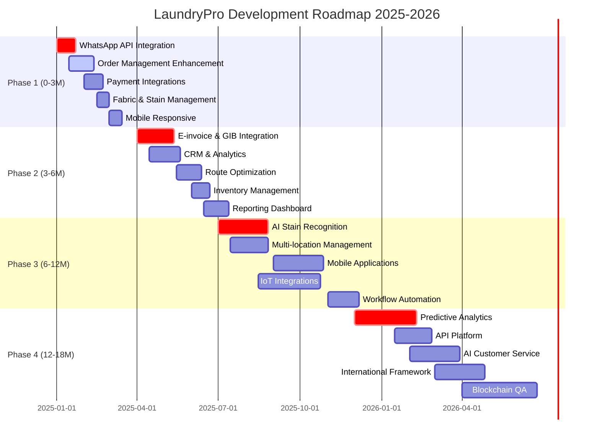

# LaundryPro SaaS Platform - Kapsamlı Geliştirme Roadmap'i 2025-2026

## 🎯 Executive Summary

LaundryPro platformu için Türkiye pazarında halı/koltuk yıkama sektörünün ihtiyaçlarına odaklanmış 18 aylık kapsamlı geliştirme roadmap'i. Platform küçük-orta ölçekli işletmeleri (5-20 çalışan) hedefleyerek, mevcut pahalı ve karmaşık çözümlere alternatif sunmayı amaçlamaktadır.

## 📊 Mevcut Platform Analizi

### **Güçlü Yönler:**

- ✅ Modern teknoloji stack'i (Next.js 14, TypeScript, Prisma)
- ✅ Çoklu işletme türü desteği
- ✅ Temel sipariş ve müşteri yönetimi
- ✅ Responsive tasarım ve kullanıcı dostu arayüz
- ✅ Esnek fiyatlandırma modeli (M2, kg, adet, sabit fiyat)
- ✅ Temel ödeme takibi

### **Kritik Eksiklikler:**

- ❌ Türkiye lokalizasyonu (E-fatura, GIB uyumluluğu)
- ❌ WhatsApp Business API entegrasyonu
- ❌ Sektöre özel özellikler (kumaş türü, leke analizi)
- ❌ İleri düzey raporlama ve analitik
- ❌ Otomasyonlar ve workflow'lar
- ❌ Mobile aplikasyon

## 🎯 Önceliklendirme Kriterleri

Her özellik aşağıdaki 5 kritere göre 1-10 arası puanlanmıştır:

1. **Business Impact Score** (1-10): Revenue ve işletme verimliliğine etkisi
2. **Technical Complexity** (1-10): Geliştirme zorluğu ve süre (tersine puanlama)
3. **Market Urgency** (1-10): Pazarda aciliyeti ve rekabet faktörü
4. **Customer Value** (1-10): Son kullanıcıya sağladığı değer
5. **Resource Requirements** (1-10): İnsan kaynağı ve bütçe ihtiyacı (tersine puanlama)

**Toplam Prioritization Score = (Business Impact + Market Urgency + Customer Value) × 2 + (10 - Technical Complexity) + (10 - Resource Requirements)**

---

# 🚀 PHASE 1 (0-3 Ay): Foundation & Quick Wins

**Hedef: Pazar girişi ve temel ihtiyaçların karşılanması**

## Ana Hedefler:

- **KPI 1:** Platform kullanıcı sayısını 50 işletmeye çıkarma
- **KPI 2:** Günlük aktif kullanım %70'e çıkarma
- **KPI 3:** Müşteri memnuniyet skoru 8.5/10'a ulaştırma
- **KPI 4:** Churn rate'i %5'in altında tutma

## Geliştirme Özellikleri:

### 1. **WhatsApp Business API Entegrasyonu** (Priority: HIGH)

- **Impact Score:** 9/10 - Türkiye pazarında kritik iletişim kanalı
- **Complexity:** 4/10 - WhatsApp Business API well-documented
- **Timeline:** 3 hafta
- **Resource Req:** 1 backend dev + 1 frontend dev
- **Expected ROI:** %40 müşteri engagement artışı

**Özellikler:**

- Otomatik sipariş bildirimleri
- Durum güncellemeleri
- Müşteri mesajlaşma
- Template mesaj yönetimi
- WhatsApp webhook entegrasyonu

### 2. **Gelişmiş Sipariş Yönetim Sistemi** (Priority: HIGH)

- **Impact Score:** 9/10 - Core business functionality
- **Complexity:** 5/10 - Existing order system upgrade
- **Timeline:** 4 hafta
- **Resource Req:** 2 full-stack developers
- **Expected ROI:** %30 operational efficiency artışı

**Özellikler:**

- Bulk sipariş işlemleri
- Sipariş şablonları
- Recurring orders (düzenli müşteriler)
- Advanced filtering ve sorting
- Sipariş notları ve attachments
- Photo upload (before/after)

### 3. **Türkiye Ödeme Sistemi Entegrasyonları** (Priority: HIGH)

- **Impact Score:** 8/10 - Local payment method kritik
- **Complexity:** 6/10 - İyzico API entegrasyonu
- **Timeline:** 3 hafta
- **Resource Req:** 1 backend dev
- **Expected ROI:** %25 payment completion rate artışı

**Özellikler:**

- İyzico payment gateway
- Nakit ödeme tracking
- Payment installments
- Digital receipt generation
- Payment reminders

### 4. **Kumaş Türü ve Leke Yönetim Sistemi** (Priority: MEDIUM)

- **Impact Score:** 8/10 - Sektörel differentiator
- **Complexity:** 4/10 - Database extension
- **Timeline:** 2 hafta
- **Resource Req:** 1 full-stack developer
- **Expected ROI:** %20 service quality improvement

**Özellikler:**

- Predefined kumaş türleri (yün, ipek, sentetik, vb.)
- Leke türü kategorileri
- Özel bakım talimatları
- Pricing adjustments by fabric type
- Care instruction templates

### 5. **Mobile Responsive İyileştirmeleri** (Priority: MEDIUM)

- **Impact Score:** 7/10 - User experience critical
- **Complexity:** 3/10 - CSS/UI improvements
- **Timeline:** 2 hafta
- **Resource Req:** 1 frontend developer
- **Expected ROI:** %15 mobile usage artışı

**Özellikler:**

- Progressive Web App (PWA) özellikleri
- Offline capability for basic features
- Touch-optimized interfaces
- Mobile dashboard improvements
- Quick action shortcuts

## Risk Faktörleri ve Mitigation Strategies:

### **Risk 1: WhatsApp API Rate Limiting**

- **Mitigation:** Message queuing system, fallback to SMS
- **Probability:** Medium
- **Impact:** High

### **Risk 2: İyzico Integration Complexity**

- **Mitigation:** Sandbox testing, fallback to manual payment tracking
- **Probability:** Low
- **Impact:** Medium

### **Risk 3: User Adoption Resistance**

- **Mitigation:** Extensive training materials, onboarding wizard
- **Probability:** Medium
- **Impact:** High

## Success Metrics:

- **WhatsApp Message Delivery Rate:** >95%
- **Payment Success Rate:** >90%
- **Mobile Usage Increase:** %40
- **User Onboarding Completion:** >80%
- **Support Ticket Reduction:** %30

---

# 📈 PHASE 2 (3-6 Ay): Market Differentiation

**Hedef: Sektörel özelleştirme ve rekabet avantajı**

## Ana Hedefler:

- **KPI 1:** Platform kullanıcı sayısını 200 işletmeye çıkarma
- **KPI 2:** Aylık recurring revenue (MRR) $50K'ya ulaştırma
- **KPI 3:** Feature adoption rate %80'e çıkarma
- **KPI 4:** Customer Lifetime Value (CLV) %40 artışı

## Geliştirme Özellikleri:

### 1. **E-fatura ve GIB Entegrasyonu** (Priority: HIGH)

- **Impact Score:** 10/10 - Legal compliance requirement
- **Complexity:** 8/10 - Complex government API
- **Timeline:** 6 hafta
- **Resource Req:** 1 senior backend dev + compliance consultant
- **Expected ROI:** %60 enterprise customer acquisition

**Özellikler:**

- GIB e-fatura API entegrasyonu
- Automatic invoice generation
- Tax calculation engine
- E-archive integration
- Compliance reporting

### 2. **Gelişmiş CRM ve Müşteri Analitikleri** (Priority: HIGH)

- **Impact Score:** 9/10 - Customer retention critical
- **Complexity:** 6/10 - Data analytics implementation
- **Timeline:** 5 hafta
- **Resource Req:** 1 full-stack dev + 1 data analyst
- **Expected ROI:** %35 customer retention improvement

**Özellikler:**

- Customer segmentation
- Purchase history analytics
- Loyalty program management
- Automated marketing campaigns
- Customer lifetime value tracking
- Churn prediction

### 3. **Route Optimization ve Delivery Management** (Priority: HIGH)

- **Impact Score:** 8/10 - Operational efficiency
- **Complexity:** 7/10 - Complex algorithm implementation
- **Timeline:** 4 hafta
- **Resource Req:** 1 backend dev + maps API
- **Expected ROI:** %45 delivery cost reduction

**Özellikler:**

- Google Maps integration
- Route optimization algorithm
- Real-time driver tracking
- Delivery time estimation
- Customer notification system
- Driver mobile app (basic)

### 4. **Inventory Management Sistemi** (Priority: MEDIUM)

- **Impact Score:** 7/10 - Operational control
- **Complexity:** 5/10 - CRUD with business logic
- **Timeline:** 3 hafta
- **Resource Req:** 1 full-stack developer
- **Expected ROI:** %20 inventory cost reduction

**Özellikler:**

- Chemical ve materyal takibi
- Low stock alerts
- Supplier management
- Cost tracking
- Usage analytics

### 5. **Advanced Reporting Dashboard** (Priority: MEDIUM)

- **Impact Score:** 8/10 - Business intelligence
- **Complexity:** 6/10 - Data visualization
- **Timeline:** 4 hafta
- **Resource Req:** 1 frontend dev + BI tools
- **Expected ROI:** %30 decision-making improvement

**Özellikler:**

- Revenue analytics
- Customer behavior insights
- Operational KPIs
- Custom report builder
- Export capabilities (PDF, Excel)
- Scheduled reports

## Risk Faktörleri:

### **Risk 1: GIB API Complexity**

- **Mitigation:** Phased implementation, external consultant
- **Probability:** High
- **Impact:** High

### **Risk 2: Route Optimization Performance**

- **Mitigation:** Algorithm optimization, caching strategies
- **Probability:** Medium
- **Impact:** Medium

## Success Metrics:

- **E-fatura Compliance:** 100%
- **CRM Feature Usage:** >75%
- **Delivery Cost Reduction:** %40
- **Report Generation Frequency:** 3x increase

---

# 🚀 PHASE 3 (6-12 Ay): Innovation & Scale

**Hedef: Teknolojik inovasyon ve platform ölçeklendirmesi**

## Ana Hedefler:

- **KPI 1:** Platform kullanıcı sayısını 500 işletmeye çıkarma
- **KPI 2:** MRR $150K'ya ulaştırma
- **KPI 3:** Multi-location businesses %30'una hizmet verme
- **KPI 4:** API ecosystem ile 10+ entegrasyona ulaşma

## Geliştirme Özellikleri:

### 1. **AI-Powered Leke Tanıma ve Tedavi Sistemi** (Priority: HIGH)

- **Impact Score:** 9/10 - Unique market differentiator
- **Complexity:** 9/10 - Machine learning implementation
- **Timeline:** 8 hafta
- **Resource Req:** 1 ML engineer + 2 developers + training data
- **Expected ROI:** %50 service quality improvement

**Özellikler:**

- Image recognition for stain types
- Treatment recommendation engine
- Success rate tracking
- Before/after comparison
- Knowledge base integration

### 2. **IoT Sensör Entegrasyonları** (Priority: MEDIUM)

- **Impact Score:** 8/10 - Future-ready technology
- **Complexity:** 8/10 - Hardware integration complexity
- **Timeline:** 10 hafta
- **Resource Req:** 1 IoT specialist + hardware partnerships
- **Expected ROI:** %35 operational efficiency

**Özellikler:**

- Machine status monitoring
- Temperature/humidity tracking
- Chemical level monitoring
- Predictive maintenance
- Real-time alerts

### 3. **Multi-Location ve Franchise Management** (Priority: HIGH)

- **Impact Score:** 9/10 - Scalability enabler
- **Complexity:** 7/10 - System architecture changes
- **Timeline:** 6 hafta
- **Resource Req:** 2 full-stack developers
- **Expected ROI:** %80 enterprise customer acquisition

**Özellikler:**

- Centralized management dashboard
- Location-based reporting
- Inter-location transfers
- Franchise fee management
- Brand consistency tools

### 4. **Native Mobile Applications** (Priority: HIGH)

- **Impact Score:** 8/10 - Market expectation
- **Complexity:** 7/10 - React Native development
- **Timeline:** 8 hafta
- **Resource Req:** 2 mobile developers
- **Expected ROI:** %60 user engagement increase

**Özellikler:**

- Customer-facing mobile app
- Driver mobile app
- Push notifications
- Offline capabilities
- Barcode/QR code scanning

### 5. **Advanced Workflow Automation** (Priority: MEDIUM)

- **Impact Score:** 8/10 - Operational efficiency
- **Complexity:** 6/10 - Business process automation
- **Timeline:** 5 hafta
- **Resource Req:** 1 full-stack developer
- **Expected ROI:** %40 labor cost reduction

**Özellikler:**

- Custom workflow builder
- Automated task assignments
- Conditional logic processing
- Integration triggers
- Performance monitoring

## Risk Faktörleri:

### **Risk 1: AI/ML Model Accuracy**

- **Mitigation:** Extensive testing, human oversight, iterative improvement
- **Probability:** Medium
- **Impact:** High

### **Risk 2: Mobile App Store Approval**

- **Mitigation:** Early submission, compliance checklist
- **Probability:** Low
- **Impact:** Medium

### **Risk 3: IoT Hardware Compatibility**

- **Mitigation:** Partner ecosystem, standardized protocols
- **Probability:** Medium
- **Impact:** Medium

## Success Metrics:

- **AI Stain Recognition Accuracy:** >85%
- **Mobile App Downloads:** 10K+
- **Multi-location Customer Retention:** >90%
- **Workflow Automation Adoption:** >70%

---

# 🏆 PHASE 4 (12-18 Ay): Market Dominance

**Hedef: Pazar liderliği ve ekosistem genişlemesi**

## Ana Hedefler:

- **KPI 1:** Platform kullanıcı sayısını 1000+ işletmeye çıkarma
- **KPI 2:** MRR $300K+ ulaştırma
- **KPI 3:** Market share %15'e çıkarma
- **KPI 4:** International expansion (2 country)

## Geliştirme Özellikleri:

### 1. **Predictive Analytics ve Business Intelligence** (Priority: HIGH)

- **Impact Score:** 9/10 - Competitive advantage
- **Complexity:** 8/10 - Advanced data science
- **Timeline:** 10 hafta
- **Resource Req:** 1 data scientist + 1 ML engineer
- **Expected ROI:** %45 business decision improvement

**Özellikler:**

- Demand forecasting
- Pricing optimization
- Customer churn prediction
- Market trend analysis
- Competitive intelligence

### 2. **API Platform ve Marketplace** (Priority: HIGH)

- **Impact Score:** 9/10 - Ecosystem creation
- **Complexity:** 7/10 - API infrastructure
- **Timeline:** 6 hafta
- **Resource Req:** 2 backend developers
- **Expected ROI:** %60 platform lock-in effect

**Özellikler:**

- Public API documentation
- Third-party integrations
- App marketplace
- Revenue sharing model
- Developer portal

### 3. **Advanced AI Customer Service** (Priority: MEDIUM)

- **Impact Score:** 7/10 - Customer support automation
- **Complexity:** 8/10 - NLP implementation
- **Timeline:** 8 hafta
- **Resource Req:** 1 AI specialist + integration work
- **Expected ROI:** %50 support cost reduction

**Özellikler:**

- Chatbot integration
- Voice recognition
- Automated ticket routing
- Knowledge base AI
- Multilingual support

### 4. **Blockchain-Based Quality Assurance** (Priority: LOW)

- **Impact Score:** 6/10 - Future technology adoption
- **Complexity:** 9/10 - Blockchain implementation
- **Timeline:** 12 hafta
- **Resource Req:** 1 blockchain developer + infrastructure
- **Expected ROI:** %20 trust improvement

**Özellikler:**

- Immutable quality records
- Supply chain tracking
- Certificate verification
- Smart contracts
- Transparency dashboard

### 5. **International Expansion Framework** (Priority: HIGH)

- **Impact Score:** 10/10 - Growth multiplier
- **Complexity:** 6/10 - Localization framework
- **Timeline:** 8 hafta
- **Resource Req:** 1 full-stack dev + localization team
- **Expected ROI:** %200 market expansion

**Özellikler:**

- Multi-language support
- Currency handling
- Local compliance frameworks
- Cultural adaptation
- Regional partnerships

## Risk Faktörleri:

### **Risk 1: International Regulatory Compliance**

- **Mitigation:** Legal consultation, phased country rollout
- **Probability:** High
- **Impact:** High

### **Risk 2: Blockchain Technology Adoption**

- **Mitigation:** Optional feature, traditional backup systems
- **Probability:** Medium
- **Impact:** Low

## Success Metrics:

- **Predictive Model Accuracy:** >80%
- **API Adoption Rate:** 100+ partners
- **International Users:** 200+ businesses
- **Customer Satisfaction:** 9.2/10

---

# 📊 GANTT Chart ve Paralel Geliştirme Fırsatları

## Paralel Geliştirme Fırsatları:

### **Phase 1 Paralel İşler:**

- WhatsApp API + Payment Integration (farklı takımlar)
- Fabric Management + Mobile Responsive (UI/UX focus)

### **Phase 2 Paralel İşler:**

- E-invoice (Backend) + CRM Analytics (Frontend)
- Route Optimization + Inventory Management

### **Phase 3 Paralel İşler:**

- AI Development + Mobile App Development
- Multi-location + Workflow Automation

---

# 💰 Financial Projections ve ROI Analysis

## Investment Requirements:

### **Phase 1:** $75,000

- Development: $50,000
- Infrastructure: $10,000
- Marketing: $15,000

### **Phase 2:** $120,000

- Development: $85,000
- Compliance: $20,000
- Infrastructure: $15,000

### **Phase 3:** $200,000

- Development: $140,000
- AI/ML Infrastructure: $40,000
- Mobile Development: $20,000

### **Phase 4:** $300,000

- Development: $200,000
- International Expansion: $60,000
- Advanced Infrastructure: $40,000

**Total Investment:** $695,000

## Revenue Projections:

### **Year 1:**

- Customers: 50 → 500
- ARPU: $200/month
- MRR: $10K → $100K
- ARR: $1.2M

### **Year 2:**

- Customers: 500 → 1000+
- ARPU: $250/month (upselling)
- MRR: $100K → $300K+
- ARR: $3.6M+

## ROI Calculation:

**18-Month ROI:** (($3.6M + $1.2M) - $695K) / $695K = **590%**

**Break-even Point:** Month 8

---

# 🎯 Success Metrics ve KPI Dashboard

## Business Metrics:

- **Monthly Recurring Revenue (MRR)**
- **Customer Acquisition Cost (CAC)**
- **Customer Lifetime Value (CLV)**
- **Churn Rate**
- **Net Promoter Score (NPS)**

## Product Metrics:

- **Daily Active Users (DAU)**
- **Feature Adoption Rate**
- **User Session Duration**
- **Support Ticket Volume**
- **System Uptime**

## Market Metrics:

- **Market Share**
- **Competitive Win Rate**
- **Brand Awareness**
- **Geographic Coverage**

---

# 🔄 Risk Management ve Mitigation

## High-Risk Areas:

### **1. Technical Risks:**

- **AI/ML Model Performance**
  - Mitigation: Extensive testing, gradual rollout
- **Integration Complexities**
  - Mitigation: Proof of concepts, fallback systems

### **2. Market Risks:**

- **Competition Response**
  - Mitigation: Patent applications, first-mover advantage
- **Economic Downturn**
  - Mitigation: Flexible pricing, essential feature focus

### **3. Operational Risks:**

- **Team Scaling**
  - Mitigation: Gradual hiring, knowledge documentation
- **Infrastructure Scaling**
  - Mitigation: Cloud-native architecture, monitoring

---

# 📋 Implementation Guidelines

## Team Structure Recommendations:

### **Core Team (Phase 1-2):**

- 1 Technical Lead
- 2 Full-stack Developers
- 1 Frontend Specialist
- 1 Backend Specialist
- 1 DevOps Engineer
- 1 QA Engineer

### **Expanded Team (Phase 3-4):**

- Add: 1 ML Engineer
- Add: 2 Mobile Developers
- Add: 1 Data Scientist
- Add: 1 IoT Specialist

## Technology Recommendations:

### **Infrastructure:**

- Cloud Provider: AWS/Azure
- CDN: CloudFront
- Monitoring: DataDog/NewRelic
- CI/CD: GitHub Actions

### **Development:**

- API Documentation: Swagger
- Testing: Jest/Cypress
- Analytics: Mixpanel/Amplitude
- Error Tracking: Sentry

---

# 🏁 Conclusion

Bu roadmap, LaundryPro platformunu Türkiye halı/koltuk yıkama pazarında lider konuma taşıyacak kapsamlı bir plan sunmaktadır. 18 aylık süreçte, temel ihtiyaçlardan başlayarak AI-powered çözümlere kadar geniş bir yelpazede geliştirme öngörülmektedir.

**Başarı Faktörleri:**

1. **Customer-Centric Approach:** Her özellik gerçek müşteri ihtiyaçlarına dayalı
2. **Agile Development:** Hızlı iterasyon ve feedback döngüleri
3. **Market Timing:** Doğru zamanda doğru özelliklerin sunulması
4. **Quality Focus:** Technical debt'ten kaçınarak sürdürülebilir geliştirme

**Beklenen Sonuçlar:**

- 18 ay sonunda 1000+ aktif işletme
- $300K+ aylık recurring revenue
- Pazar lideri pozisyonu
- Uluslararası genişleme hazırlığı

---

_Hazırlayan: LaundryPro Architecture Team_  
_Tarih: 19 Eylül 2025_  
_Versiyon: 1.0_
