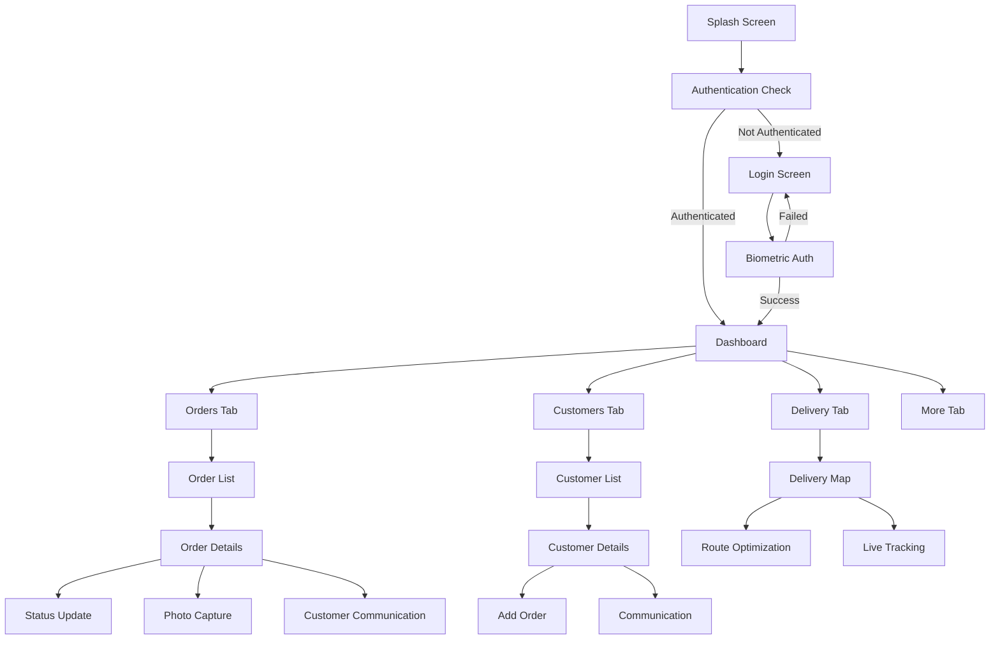

# LaundryPro Mobile App - Comprehensive Technical Specification

## Executive Summary

This document outlines the complete technical specification for developing a React Native Expo mobile application that seamlessly integrates with the existing LaundryPro cleaning business management system. The mobile app will provide business owners and employees with full operational capabilities, enhanced with mobile-specific features for improved workflow efficiency.

## 1. System Analysis Summary

### 1.1 Existing Backend Architecture

- **Framework**: Next.js with TypeScript
- **Database**: MySQL with Prisma ORM
- **Authentication**: JWT-based with role-based access control
- **Multi-tenancy**: Business isolation with businessId scoping
- **API Structure**: RESTful endpoints with comprehensive CRUD operations

### 1.2 Core Entities Analyzed

- **Business**: Multi-tenant business management
- **Users**: Role-based access (OWNER, MANAGER, EMPLOYEE, DRIVER)
- **Customers**: Customer management with contact details
- **Orders**: Complete order lifecycle management
- **Services**: Service catalog with pricing
- **WhatsApp Integration**: Business API integration
- **E-Invoice**: Turkish tax system integration

### 1.3 Key API Endpoints Available

```
Authentication:
- POST /api/auth/login
- POST /api/auth/register

Core Operations:
- GET/POST/PUT/DELETE /api/orders
- GET/POST/PUT/DELETE /api/customers
- GET/POST /api/services
- GET /api/dashboard/stats

Communication:
- POST /api/whatsapp/send
- GET /api/whatsapp/status
- GET /api/whatsapp/templates

Business Management:
- GET/PUT /api/business
- GET/POST/PUT/DELETE /api/users
```

## 2. Mobile App Requirements & Constraints

### 2.1 Confirmed Requirements

- **Platform**: Cross-platform React Native Expo
- **Primary Users**: Business owners & employees
- **Offline Support**: Full CRUD with synchronization
- **Timeline**: 3-4 months development
- **Integrations**: All mobile features required

### 2.2 Technical Constraints

- Must maintain data consistency with existing web app
- Preserve existing JWT authentication system
- Support all business types (laundry, dry cleaning, carpet cleaning, etc.)
- Turkish language support required
- Multi-tenant architecture compliance

## 3. Mobile App Architecture & Tech Stack

### 3.1 Core Technology Stack

```typescript
// Primary Technologies
- React Native: 0.72.x
- Expo SDK: 49.x
- TypeScript: 5.x
- React Navigation: 6.x

// State Management
- Redux Toolkit: 1.9.x
- RTK Query: For API management
- Redux Persist: For offline state persistence

// Local Database & Storage
- Expo SQLite: Local data storage
- AsyncStorage: Settings and tokens
- Expo SecureStore: Sensitive data storage

// Mobile-Specific Features
- Expo Camera: Order documentation
- Expo Location: GPS tracking
- Expo Notifications: Push notifications
- Expo BarCodeScanner: QR/Barcode scanning
- Expo Contacts: Customer management

// UI/UX Libraries
- React Native Paper: Material Design components
- React Native Vector Icons: Icon library
- React Native Gesture Handler: Touch interactions
- React Native Reanimated: Smooth animations

// Networking & Sync
- Axios: HTTP client
- React Query: Server state management
- NetInfo: Network connectivity detection

// Development Tools
- Expo Development Build: Custom native modules
- EAS Build: Cloud build service
- EAS Submit: App store deployment
```

### 3.2 Project Structure

```
laundry-pro-mobile/
├── src/
│   ├── components/           # Reusable UI components
│   │   ├── common/          # Generic components
│   │   ├── forms/           # Form components
│   │   ├── cards/           # Order, customer cards
│   │   └── modals/          # Modal dialogs
│   ├── screens/             # Screen components
│   │   ├── auth/            # Login, register screens
│   │   ├── dashboard/       # Dashboard and stats
│   │   ├── orders/          # Order management screens
│   │   ├── customers/       # Customer management
│   │   ├── services/        # Service management
│   │   ├── delivery/        # Delivery tracking
│   │   ├── camera/          # Photo capture screens
│   │   └── settings/        # App settings
│   ├── navigation/          # Navigation configuration
│   │   ├── AppNavigator.tsx # Main navigation
│   │   ├── AuthNavigator.tsx# Auth flow navigation
│   │   └── TabNavigator.tsx # Bottom tab navigation
│   ├── store/               # Redux store configuration
│   │   ├── slices/          # Redux slices
│   │   ├── api/             # RTK Query API definitions
│   │   └── middleware/      # Custom middleware
│   ├── services/            # Business logic services
│   │   ├── api/             # API service layer
│   │   ├── database/        # Local database operations
│   │   ├── sync/            # Data synchronization
│   │   ├── notifications/   # Push notification handling
│   │   └── location/        # GPS and location services
│   ├── utils/               # Utility functions
│   │   ├── helpers/         # General helpers
│   │   ├── validators/      # Form validation
│   │   ├── formatters/      # Data formatting
│   │   └── constants/       # App constants
│   ├── types/               # TypeScript type definitions
│   └── assets/              # Static assets
├── app.config.js            # Expo configuration
├── package.json             # Dependencies
└── tsconfig.json           # TypeScript configuration
```

## 4. Feature Mapping: Web to Mobile

### 4.1 Core Features Mapping

| Web Feature             | Mobile Implementation              | Priority | Notes                              |
| ----------------------- | ---------------------------------- | -------- | ---------------------------------- |
| **Authentication**      |
| Login/Register          | Native forms with biometric option | High     | Enhanced with fingerprint/face ID  |
| JWT Management          | Secure token storage               | High     | Use Expo SecureStore               |
| **Dashboard**           |
| Stats Overview          | Card-based mobile layout           | High     | Touch-friendly stats cards         |
| Recent Orders           | Swipeable order cards              | High     | Infinite scroll implementation     |
| Quick Actions           | Floating action buttons            | High     | Material design FAB                |
| **Order Management**    |
| Order List              | Card-based with filtering          | High     | Enhanced filtering UI              |
| Order Creation          | Multi-step form wizard             | High     | Camera integration for photos      |
| Order Details           | Mobile-optimized layout            | High     | Swipe actions for quick updates    |
| Status Updates          | Quick action buttons               | High     | One-tap status changes             |
| **Customer Management** |
| Customer List           | Searchable cards                   | High     | Integrated contact picker          |
| Customer Creation       | Smart form with validation         | High     | Auto-complete from device contacts |
| Customer Details        | Action-oriented layout             | High     | Direct call/message buttons        |
| **Communication**       |
| WhatsApp Integration    | Native share integration           | High     | Direct WhatsApp API calls          |
| Phone Calls             | Native dialer integration          | High     | One-tap calling                    |
| SMS/Email               | Native messaging apps              | Medium   | System app integration             |
| **Services**            |
| Service Management      | Simplified mobile forms            | Medium   | Focus on pricing updates           |
| Service Catalog         | Grid/list toggle view              | Medium   | Photo-based service display        |
| **Delivery**            |
| Route Planning          | Map-based interface                | High     | GPS navigation integration         |
| Delivery Tracking       | Real-time location                 | High     | Live tracking for customers        |
| **Settings**            |
| Business Settings       | Mobile-friendly forms              | Medium   | Essential settings only            |
| User Management         | Simplified role management         | Low      | Basic user operations              |

### 4.2 Mobile-Enhanced Features

| Feature                 | Description                         | Implementation                        |
| ----------------------- | ----------------------------------- | ------------------------------------- |
| **Photo Documentation** | Order before/after photos           | Expo Camera with local storage        |
| **GPS Tracking**        | Real-time delivery tracking         | Expo Location with background updates |
| **Push Notifications**  | Order updates, reminders            | Expo Notifications with FCM           |
| **Offline Mode**        | Full functionality without internet | SQLite with sync queue                |
| **Barcode Scanning**    | Quick order/customer lookup         | Expo BarCodeScanner                   |
| **Voice Notes**         | Audio notes for orders              | Expo Audio recording                  |
| **Quick Actions**       | Swipe gestures for common tasks     | React Native Gesture Handler          |

## 5. Mobile-Specific Features & Integrations

### 5.1 Camera Integration

```typescript
// Camera Service Implementation
import { Camera } from "expo-camera";
import * as MediaLibrary from "expo-media-library";

export class CameraService {
  static async captureOrderPhoto(orderId: string, type: "before" | "after") {
    const photo = await camera.takePictureAsync({
      quality: 0.8,
      base64: false,
      skipProcessing: false,
    });

    // Store locally first for offline support
    const localUri = await this.storePhotoLocally(photo.uri, orderId, type);

    // Queue for upload when online
    await this.queuePhotoUpload(localUri, orderId, type);

    return localUri;
  }
}
```

### 5.2 GPS & Location Services

```typescript
// Location Service
import * as Location from "expo-location";
import * as TaskManager from "expo-task-manager";

const LOCATION_TRACKING = "location-tracking";

export class LocationService {
  static async startDeliveryTracking(orderId: string) {
    await Location.startLocationUpdatesAsync(LOCATION_TRACKING, {
      accuracy: Location.Accuracy.High,
      timeInterval: 5000,
      distanceInterval: 10,
    });
  }

  static async getCurrentLocation() {
    const location = await Location.getCurrentPositionAsync({
      accuracy: Location.Accuracy.High,
    });
    return location;
  }
}

// Background location tracking
TaskManager.defineTask(LOCATION_TRACKING, ({ data, error }) => {
  if (error) {
    console.error(error);
    return;
  }
  if (data) {
    const { locations } = data as any;
    // Update delivery location in local database
    locations.forEach((location: any) => {
      DatabaseService.updateDeliveryLocation(location);
    });
  }
});
```

### 5.3 Push Notifications

```typescript
// Notification Service
import * as Notifications from "expo-notifications";

export class NotificationService {
  static async initialize() {
    const { status } = await Notifications.requestPermissionsAsync();
    if (status !== "granted") {
      alert("Push bildirimleri için izin gerekli!");
      return;
    }

    const token = (await Notifications.getExpoPushTokenAsync()).data;
    // Send token to backend for storage
    await APIService.updatePushToken(token);
  }

  static async scheduleOrderReminder(order: Order) {
    await Notifications.scheduleNotificationAsync({
      content: {
        title: `Sipariş Hatırlatması: ${order.orderNumber}`,
        body: `${order.customer.firstName} - Teslimat zamanı yaklaşıyor`,
        data: { orderId: order.id, type: "order_reminder" },
      },
      trigger: {
        date: new Date(order.deliveryDate!.getTime() - 60 * 60 * 1000), // 1 hour before
      },
    });
  }
}
```

### 5.4 Offline Synchronization

```typescript
// Sync Service
export class SyncService {
  private static syncQueue: SyncOperation[] = [];

  static async addToSyncQueue(operation: SyncOperation) {
    this.syncQueue.push(operation);
    await AsyncStorage.setItem("syncQueue", JSON.stringify(this.syncQueue));
  }

  static async processSyncQueue() {
    const isOnline = await NetInfo.fetch().then((state) => state.isConnected);
    if (!isOnline) return;

    for (const operation of this.syncQueue) {
      try {
        await this.executeOperation(operation);
        this.removeFromQueue(operation.id);
      } catch (error) {
        console.error("Sync operation failed:", error);
        // Retry logic or move to failed queue
      }
    }
  }

  private static async executeOperation(operation: SyncOperation) {
    switch (operation.type) {
      case "CREATE_ORDER":
        return await APIService.createOrder(operation.data);
      case "UPDATE_ORDER":
        return await APIService.updateOrder(operation.id, operation.data);
      case "UPLOAD_PHOTO":
        return await APIService.uploadPhoto(operation.data);
      // ... other operations
    }
  }
}
```

## 6. User Experience & Navigation Design

### 6.1 Navigation Architecture

```typescript
// Navigation Structure
const AppNavigator = () => (
  <NavigationContainer>
    <Stack.Navigator>
      {isAuthenticated ? (
        <Stack.Screen
          name="MainTabs"
          component={MainTabNavigator}
          options={{ headerShown: false }}
        />
      ) : (
        <Stack.Screen
          name="Auth"
          component={AuthNavigator}
          options={{ headerShown: false }}
        />
      )}
    </Stack.Navigator>
  </NavigationContainer>
);

const MainTabNavigator = () => (
  <Tab.Navigator
    screenOptions={{
      tabBarActiveTintColor: "#2196F3",
      tabBarInactiveTintColor: "#757575",
    }}
  >
    <Tab.Screen
      name="Dashboard"
      component={DashboardScreen}
      options={{
        tabBarIcon: ({ color }) => <Icon name="dashboard" color={color} />,
        title: "Anasayfa",
      }}
    />
    <Tab.Screen
      name="Orders"
      component={OrdersNavigator}
      options={{
        tabBarIcon: ({ color }) => <Icon name="receipt" color={color} />,
        title: "Siparişler",
      }}
    />
    <Tab.Screen
      name="Customers"
      component={CustomersNavigator}
      options={{
        tabBarIcon: ({ color }) => <Icon name="people" color={color} />,
        title: "Müşteriler",
      }}
    />
    <Tab.Screen
      name="Delivery"
      component={DeliveryNavigator}
      options={{
        tabBarIcon: ({ color }) => <Icon name="local-shipping" color={color} />,
        title: "Teslimat",
      }}
    />
    <Tab.Screen
      name="More"
      component={MoreNavigator}
      options={{
        tabBarIcon: ({ color }) => <Icon name="more-horiz" color={color} />,
        title: "Diğer",
      }}
    />
  </Tab.Navigator>
);
```

### 6.2 Screen Flow Diagrams



### 6.3 Mobile UI/UX Patterns

#### Touch-Friendly Design

- **Minimum Touch Target**: 44px (iOS) / 48dp (Android)
- **Card-Based Layout**: Material Design cards for content
- **Swipe Actions**: Left/right swipe for quick actions
- **Pull-to-Refresh**: Standard refresh pattern
- **Infinite Scroll**: Pagination for large lists

#### Order Management Flow

```typescript
// Order Card Component
const OrderCard: React.FC<OrderCardProps> = ({
  order,
  onStatusUpdate,
  onCall,
  onWhatsApp,
}) => {
  const swipeActions = [
    {
      text: "Ara",
      color: "#4CAF50",
      onPress: () => onCall(order.customer.phone),
      icon: "phone",
    },
    {
      text: "WhatsApp",
      color: "#25D366",
      onPress: () => onWhatsApp(order.customer.whatsapp),
      icon: "message",
    },
  ];

  return (
    <SwipeRow rightOpenValue={-150} rightActionValue={-300}>
      <View style={styles.hiddenItem}>
        {swipeActions.map((action, index) => (
          <TouchableOpacity
            key={index}
            style={[styles.actionButton, { backgroundColor: action.color }]}
            onPress={action.onPress}
          >
            <Icon name={action.icon} size={20} color="white" />
            <Text style={styles.actionText}>{action.text}</Text>
          </TouchableOpacity>
        ))}
      </View>
      <Card style={styles.orderCard}>
        <Card.Content>
          <OrderContent order={order} onStatusUpdate={onStatusUpdate} />
        </Card.Content>
      </Card>
    </SwipeRow>
  );
};
```

## 7. Data Storage & Synchronization Strategy

### 7.1 Local Database Schema

```sql
-- SQLite Local Database Schema
CREATE TABLE orders_local (
    id TEXT PRIMARY KEY,
    order_number TEXT NOT NULL,
    customer_id TEXT,
    business_id TEXT,
    status TEXT,
    total_amount REAL,
    created_at DATETIME,
    updated_at DATETIME,
    sync_status TEXT DEFAULT 'pending', -- pending, synced, failed
    last_sync_at DATETIME,
    local_photos TEXT -- JSON array of local photo paths
);

CREATE TABLE customers_local (
    id TEXT PRIMARY KEY,
    business_id TEXT,
    first_name TEXT,
    last_name TEXT,
    phone TEXT,
    whatsapp TEXT,
    email TEXT,
    address TEXT,
    created_at DATETIME,
    updated_at DATETIME,
    sync_status TEXT DEFAULT 'pending'
);

CREATE TABLE sync_queue (
    id INTEGER PRIMARY KEY AUTOINCREMENT,
    operation_type TEXT, -- CREATE, UPDATE, DELETE, UPLOAD
    entity_type TEXT,    -- order, customer, photo
    entity_id TEXT,
    data TEXT,           -- JSON data
    created_at DATETIME,
    retry_count INTEGER DEFAULT 0,
    last_error TEXT
);

CREATE TABLE app_settings (
    key TEXT PRIMARY KEY,
    value TEXT,
    updated_at DATETIME
);
```

### 7.2 Synchronization Logic

```typescript
// Sync Strategy Implementation
export class SyncManager {
  private static instance: SyncManager;
  private syncInProgress = false;

  static getInstance(): SyncManager {
    if (!this.instance) {
      this.instance = new SyncManager();
    }
    return this.instance;
  }

  async performFullSync(): Promise<SyncResult> {
    if (this.syncInProgress) {
      return { status: "already_running" };
    }

    this.syncInProgress = true;

    try {
      // 1. Upload pending local changes
      await this.uploadPendingChanges();

      // 2. Download server updates
      await this.downloadServerUpdates();

      // 3. Resolve conflicts
      await this.resolveConflicts();

      return { status: "success", lastSync: new Date() };
    } catch (error) {
      return { status: "error", error: error.message };
    } finally {
      this.syncInProgress = false;
    }
  }

  private async uploadPendingChanges() {
    const pendingOperations = await DatabaseService.getPendingOperations();

    for (const operation of pendingOperations) {
      try {
        await this.executeServerOperation(operation);
        await DatabaseService.markOperationSynced(operation.id);
      } catch (error) {
        await DatabaseService.markOperationFailed(operation.id, error.message);
      }
    }
  }

  private async downloadServerUpdates() {
    const lastSync = await this.getLastSyncTimestamp();

    // Download updated orders
    const updatedOrders = await APIService.getOrdersSince(lastSync);
    await DatabaseService.updateLocalOrders(updatedOrders);

    // Download updated customers
    const updatedCustomers = await APIService.getCustomersSince(lastSync);
    await DatabaseService.updateLocalCustomers(updatedCustomers);
  }
}
```

## 8. Implementation Strategy & Development Phases

### 8.1 Development Phases Overview

#### Phase 1: Foundation & Core Features (4-6 weeks)

- **Week 1-2**: Project setup, authentication, basic navigation
- **Week 3-4**: Core data layer, offline database, sync foundation
- **Week 5-6**: Order management (list, create, view, update)

#### Phase 2: Enhanced Features (4-5 weeks)

- **Week 7-8**: Customer management, communication integration
- **Week 9-10**: Camera integration, photo management
- **Week 11**: Dashboard, statistics, basic reporting

#### Phase 3: Mobile-Specific Features (3-4 weeks)

- **Week 12-13**: GPS tracking, delivery management
- **Week 14**: Push notifications, background sync
- **Week 15**: Barcode scanning, advanced features

#### Phase 4: Polish & Deployment (2-3 weeks)

- **Week 16**: Performance optimization, testing
- **Week 17**: App store preparation, final testing
- **Week 18**: Deployment, monitoring setup

### 8.2 Detailed Phase 1 Implementation

```typescript
// Week 1-2: Authentication & Navigation
// AuthContext.tsx
export const AuthContext = createContext<AuthContextType | undefined>(
  undefined
);

export const AuthProvider: React.FC<{ children: React.ReactNode }> = ({
  children,
}) => {
  const [user, setUser] = useState<User | null>(null);
  const [loading, setLoading] = useState(true);

  useEffect(() => {
    // Check for stored authentication
    checkStoredAuth();
  }, []);

  const checkStoredAuth = async () => {
    try {
      const token = await SecureStore.getItemAsync("auth_token");
      if (token) {
        const userData = await SecureStore.getItemAsync("user_data");
        if (userData) {
          setUser(JSON.parse(userData));
        }
      }
    } catch (error) {
      console.error("Auth check failed:", error);
    } finally {
      setLoading(false);
    }
  };

  const login = async (
    email: string,
    password: string
  ): Promise<LoginResult> => {
    try {
      const response = await APIService.login(email, password);

      // Store authentication securely
      await SecureStore.setItemAsync("auth_token", response.token);
      await SecureStore.setItemAsync(
        "user_data",
        JSON.stringify(response.user)
      );

      setUser(response.user);
      return { success: true };
    } catch (error) {
      return { success: false, error: error.message };
    }
  };

  return (
    <AuthContext.Provider value={{ user, login, logout, loading }}>
      {children}
    </AuthContext.Provider>
  );
};
```

```typescript
// Week 3-4: Database Layer
// DatabaseService.ts
export class DatabaseService {
  private static db: SQLite.Database;

  static async initialize() {
    this.db = SQLite.openDatabase("laundry_pro.db");

    await this.createTables();
    await this.setupInitialData();
  }

  static async createTables() {
    return new Promise<void>((resolve, reject) => {
      this.db.transaction(
        (tx) => {
          // Create orders table
          tx.executeSql(`
            CREATE TABLE IF NOT EXISTS orders_local (
              id TEXT PRIMARY KEY,
              order_number TEXT NOT NULL,
              customer_id TEXT,
              business_id TEXT,
              status TEXT,
              total_amount REAL,
              created_at DATETIME,
              updated_at DATETIME,
              sync_status TEXT DEFAULT 'pending',
              last_sync_at DATETIME,
              local_data TEXT
            );
          `);

          // Create customers table
          tx.executeSql(`
            CREATE TABLE IF NOT EXISTS customers_local (
              id TEXT PRIMARY KEY,
              business_id TEXT,
              first_name TEXT,
              last_name TEXT,
              phone TEXT,
              whatsapp TEXT,
              email TEXT,
              address TEXT,
              created_at DATETIME,
              updated_at DATETIME,
              sync_status TEXT DEFAULT 'pending'
            );
          `);

          // Create sync queue table
          tx.executeSql(`
            CREATE TABLE IF NOT EXISTS sync_queue (
              id INTEGER PRIMARY KEY AUTOINCREMENT,
              operation_type TEXT,
              entity_type TEXT,
              entity_id TEXT,
              data TEXT,
              created_at DATETIME,
              retry_count INTEGER DEFAULT 0,
              last_error TEXT
            );
          `);
        },
        (error) => reject(error),
        () => resolve()
      );
    });
  }

  // Order operations
  static async createOrder(orderData: CreateOrderData): Promise<Order> {
    const orderId = uuidv4();
    const order = {
      id: orderId,
      ...orderData,
      createdAt: new Date().toISOString(),
      updatedAt: new Date().toISOString(),
      syncStatus: "pending",
    };

    return new Promise((resolve, reject) => {
      this.db.transaction(
        (tx) => {
          tx.executeSql(
            "INSERT INTO orders_local (id, order_number, customer_id, business_id, status, total_amount, created_at, updated_at, sync_status, local_data) VALUES (?, ?, ?, ?, ?, ?, ?, ?, ?, ?)",
            [
              order.id,
              order.orderNumber,
              order.customerId,
              order.businessId,
              order.status,
              order.totalAmount,
              order.createdAt,
              order.updatedAt,
              order.syncStatus,
              JSON.stringify(order),
            ]
          );

          // Add to sync queue
          tx.executeSql(
            "INSERT INTO sync_queue (operation_type, entity_type, entity_id, data, created_at) VALUES (?, ?, ?, ?, ?)",
            [
              "CREATE",
              "order",
              order.id,
              JSON.stringify(order),
              new Date().toISOString(),
            ]
          );
        },
        (error) => reject(error),
        () => resolve(order)
      );
    });
  }
}
```

### 8.3 Testing Strategy

```typescript
// Testing Approach
describe("Order Management", () => {
  describe("Offline Mode", () => {
    beforeEach(async () => {
      // Set up offline environment
      await NetInfo.setConnectionStatus(false);
    });

    it("should create order locally when offline", async () => {
      const orderData = {
        customerId: "test-customer",
        services: [{ serviceId: "test-service", quantity: 1, unitPrice: 100 }],
      };

      const order = await OrderService.createOrder(orderData);
      expect(order.syncStatus).toBe("pending");

      const localOrder = await DatabaseService.getOrder(order.id);
      expect(localOrder).toBeDefined();
    });

    it("should sync orders when back online", async () => {
      // Create order offline
      const order = await OrderService.createOrder(testOrderData);

      // Go back online
      await NetInfo.setConnectionStatus(true);

      // Trigger sync
      await SyncManager.getInstance().performFullSync();

      const updatedOrder = await DatabaseService.getOrder(order.id);
      expect(updatedOrder.syncStatus).toBe("synced");
    });
  });
});
```

## 9. Integration Points with Existing Backend

### 9.1 API Integration Layer

```typescript
// APIService.ts - Centralized API communication
export class APIService {
  private static baseURL = "https://your-backend.com/api";
  private static authToken: string | null = null;

  static async initialize() {
    this.authToken = await SecureStore.getItemAsync("auth_token");

    // Setup axios interceptors
    axios.interceptors.request.use((config) => {
      if (this.authToken) {
        config.headers.Authorization = `Bearer ${this.authToken}`;
      }
      return config;
    });

    axios.interceptors.response.use(
      (response) => response,
      async (error) => {
        if (error.response?.status === 401) {
          // Token expired, redirect to login
          await this.clearAuthToken();
          // Navigate to login screen
        }
        return Promise.reject(error);
      }
    );
  }

  // Authentication
  static async login(email: string, password: string): Promise<LoginResponse> {
    const response = await axios.post(`${this.baseURL}/auth/login`, {
      email,
      password,
    });

    this.authToken = response.data.token;
    await SecureStore.setItemAsync("auth_token", this.authToken);

    return response.data;
  }

  // Orders API
  static async getOrders(params: OrderFilters): Promise<OrderResponse> {
    const response = await axios.get(`${this.baseURL}/orders`, { params });
    return response.data;
  }

  static async createOrder(orderData: CreateOrderData): Promise<Order> {
    const response = await axios.post(`${this.baseURL}/orders`, orderData);
    return response.data.order;
  }

  static async updateOrder(
    orderId: string,
    data: UpdateOrderData
  ): Promise<Order> {
    const response = await axios.put(`${this.baseURL}/orders/${orderId}`, data);
    return response.data.order;
  }

  // Customers API
  static async getCustomers(): Promise<Customer[]> {
    const response = await axios.get(`${this.baseURL}/customers`);
    return response.data;
  }

  static async createCustomer(
    customerData: CreateCustomerData
  ): Promise<Customer> {
    const response = await axios.post(
      `${this.baseURL}/customers`,
      customerData
    );
    return response.data.customer;
  }

  // WhatsApp Integration
  static async sendWhatsAppMessage(
    data: WhatsAppMessageData
  ): Promise<MessageResponse> {
    const response = await axios.post(`${this.baseURL}/whatsapp/send`, data);
    return response.data;
  }

  // File Upload
  static async uploadPhoto(
    orderId: string,
    photoUri: string
  ): Promise<UploadResponse> {
    const formData = new FormData();
    formData.append("photo", {
      uri: photoUri,
      type: "image/jpeg",
      name: `order_${orderId}_${Date.now()}.jpg`,
    } as any);
    formData.append("orderId", orderId);

    const response = await axios.post(
      `${this.baseURL}/orders/upload-photo`,
      formData,
      {
        headers: {
          "Content-Type": "multipart/form-data",
        },
      }
    );

    return response.data;
  }
}
```

### 9.2 Real-time Synchronization

```typescript
// WebSocket connection for real-time updates
export class WebSocketService {
  private static ws: WebSocket | null = null;
  private static reconnectAttempts = 0;
  private static maxReconnectAttempts = 5;

  static connect(userId: string, businessId: string) {
    const wsUrl = `wss://your-backend.com/ws?userId=${userId}&businessId=${businessId}`;

    this.ws = new WebSocket(wsUrl);

    this.ws.onopen = () => {
      console.log("WebSocket connected");
      this.reconnectAttempts = 0;
    };

    this.ws.onmessage = (event) => {
      const data = JSON.parse(event.data);
      this.handleMessage(data);
    };

    this.ws.onclose = () => {
      console.log("WebSocket disconnected");
      this.attemptReconnection(userId, businessId);
    };

    this.ws.onerror = (error) => {
      console.error("WebSocket error:", error);
    };
  }

  private static handleMessage(data: WebSocketMessage) {
    switch (data.type) {
      case "ORDER_UPDATED":
        // Update local order
        DatabaseService.updateOrder(data.orderId, data.orderData);
        // Notify UI components
        EventEmitter.emit("orderUpdated", data.orderData);
        break;

      case "NEW_ORDER":
        // Add new order to local database
        DatabaseService.addOrder(data.orderData);
        // Show notification
        NotificationService.showLocalNotification(
          "Yeni Sipariş",
          `${data.orderData.customer} - ${data.orderData.orderNumber}`
        );
        break;

      case "WHATSAPP_MESSAGE":
        // Handle incoming WhatsApp message
        this.handleWhatsAppMessage(data);
        break;
    }
  }
}
```

## 10. Performance Optimization Strategy

### 10.1 App Performance

```typescript
// Performance optimizations
export const optimizationStrategies = {
  // Image optimization
  imageOptimization: {
    resizeImages: async (uri: string, maxWidth: number = 1200) => {
      const manipResult = await ImageManipulator.manipulateAsync(
        uri,
        [{ resize: { width: maxWidth } }],
        { compress: 0.8, format: ImageManipulator.SaveFormat.JPEG }
      );
      return manipResult.uri;
    },

    lazyLoadImages: true,
    cacheImages: true,
  },

  // List optimization
  listOptimization: {
    useVirtualizedList: true,
    initialNumToRender: 10,
    maxToRenderPerBatch: 5,
    windowSize: 10,
  },

  // Database optimization
  databaseOptimization: {
    useIndexes: [
      "CREATE INDEX IF NOT EXISTS idx_orders_status ON orders_local(status)",
      "CREATE INDEX IF NOT EXISTS idx_orders_business_id ON orders_local(business_id)",
      "CREATE INDEX IF NOT EXISTS idx_customers_phone ON customers_local(phone)",
    ],

    usePagination: true,
    pageSize: 20,
  },

  // Memory management
  memoryManagement: {
    clearImageCache: () => {
      // Clear cached images periodically
      ImageCache.clear();
    },

    limitStoredData: async () => {
      // Keep only last 30 days of data locally
      const thirtyDaysAgo = new Date(Date.now() - 30 * 24 * 60 * 60 * 1000);
      await DatabaseService.deleteOldRecords(thirtyDaysAgo);
    },
  },
};
```

### 10.2 Network Optimization

```typescript
// Network optimization strategies
export class NetworkOptimizer {
  static async optimizedRequest(
    requestFn: () => Promise<any>,
    cacheKey: string,
    ttl: number = 5 * 60 * 1000 // 5 minutes
  ) {
    // Check cache first
    const cached = await this.getFromCache(cacheKey);
    if (cached && Date.now() - cached.timestamp < ttl) {
      return cached.data;
    }

    try {
      const data = await requestFn();
      // Cache the result
      await this.saveToCache(cacheKey, data);
      return data;
    } catch (error) {
      // Return cached data if available, even if expired
      if (cached) {
        return cached.data;
      }
      throw error;
    }
  }

  static async batchRequests<T>(
    requests: Array<() => Promise<T>>,
    batchSize: number = 3
  ): Promise<T[]> {
    const results: T[] = [];

    for (let i = 0; i < requests.length; i += batchSize) {
      const batch = requests.slice(i, i + batchSize);
      const batchResults = await Promise.all(batch.map((req) => req()));
      results.push(...batchResults);
    }

    return results;
  }
}
```

## 11. Security Considerations

### 11.1 Data Security

```typescript
// Security implementation
export class SecurityService {
  // Secure token storage
  static async storeSecureToken(key: string, token: string) {
    await SecureStore.setItemAsync(key, token, {
      keychainService: "LaundryProKeychain",
      sharedPreferencesName: "LaundryProPrefs",
      encrypt: true,
    });
  }

  // Data encryption for sensitive local storage
  static async encryptSensitiveData(data: string): Promise<string> {
    const key = await this.getOrCreateEncryptionKey();
    return await Crypto.digestStringAsync(
      Crypto.CryptoDigestAlgorithm.SHA256,
      data + key
    );
  }

  // Biometric authentication
  static async enableBiometricAuth(): Promise<boolean> {
    const isAvailable = await LocalAuthentication.hasHardwareAsync();
    if (!isAvailable) return false;

    const isEnrolled = await LocalAuthentication.isEnrolledAsync();
    if (!isEnrolled) return false;

    const result = await LocalAuthentication.authenticateAsync({
      promptMessage: "LaundryPro'ya giriş yapmak için parmak izinizi kullanın",
      cancelLabel: "İptal",
      fallbackLabel: "Şifre kullan",
    });

    return result.success;
  }

  // API request signing
  static async signRequest(data: any, timestamp: number): Promise<string> {
    const key = await SecureStore.getItemAsync("api_secret");
    const payload = JSON.stringify(data) + timestamp.toString();
    return await Crypto.digestStringAsync(
      Crypto.CryptoDigestAlgorithm.SHA256,
      payload + key
    );
  }
}
```

### 11.2 Privacy Compliance

```typescript
// Privacy and GDPR compliance
export class PrivacyService {
  static async requestDataProcessingConsent(): Promise<boolean> {
    return new Promise((resolve) => {
      Alert.alert(
        "Veri İşleme Onayı",
        "LaundryPro uygulaması, hizmet kalitesini artırmak için konum ve kamera verilerinizi işleyebilir. Bu verilerin işlenmesine onay veriyor musunuz?",
        [
          {
            text: "Hayır",
            onPress: () => resolve(false),
            style: "cancel",
          },
          {
            text: "Evet",
            onPress: () => resolve(true),
          },
        ]
      );
    });
  }

  static async exportUserData(userId: string): Promise<string> {
    // Export all user data for GDPR compliance
    const userData = await DatabaseService.getUserData(userId);
    return JSON.stringify(userData, null, 2);
  }

  static async deleteUserData(userId: string): Promise<void> {
    // Delete all user data (right to be forgotten)
    await DatabaseService.deleteUserData(userId);
    await SecureStore.deleteItemAsync("auth_token");
    await SecureStore.deleteItemAsync("user_data");
  }
}
```

## 12. Deployment & Distribution Strategy

### 12.1 Build Configuration

```javascript
// app.config.js
export default {
  expo: {
    name: "LaundryPro Mobile",
    slug: "laundry-pro-mobile",
    version: "1.0.0",
    orientation: "portrait",
    icon: "./src/assets/icon.png",
    userInterfaceStyle: "automatic",
    splash: {
      image: "./src/assets/splash.png",
      resizeMode: "contain",
      backgroundColor: "#2196F3",
    },
    assetBundlePatterns: ["**/*"],
    ios: {
      supportsTablet: true,
      bundleIdentifier: "com.laundrybusiness.pro",
      infoPlist: {
        NSCameraUsageDescription:
          "Sipariş fotoğrafları çekmek için kamera erişimi gerekli",
        NSLocationWhenInUseUsageDescription:
          "Teslimat takibi için konum erişimi gerekli",
        NSContactsUsageDescription:
          "Müşteri bilgilerini kolayca eklemek için rehber erişimi",
      },
    },
    android: {
      adaptiveIcon: {
        foregroundImage: "./src/assets/adaptive-icon.png",
        backgroundColor: "#FFFFFF",
      },
      package: "com.laundrybusiness.pro",
      permissions: [
        "CAMERA",
        "ACCESS_FINE_LOCATION",
        "ACCESS_COARSE_LOCATION",
        "READ_CONTACTS",
        "CALL_PHONE",
        "VIBRATE",
        "RECEIVE_BOOT_COMPLETED",
      ],
    },
    web: {
      favicon: "./src/assets/favicon.png",
    },
    plugins: [
      "expo-camera",
      "expo-location",
      "expo-contacts",
      "expo-local-authentication",
      [
        "expo-notifications",
        {
          icon: "./src/assets/notification-icon.png",
          color: "#2196F3",
        },
      ],
    ],
    extra: {
      eas: {
        projectId: "your-eas-project-id",
      },
    },
  },
};
```

### 12.2 EAS Build Configuration

```json
// eas.json
{
  "cli": {
    "version": ">= 5.2.0"
  },
  "build": {
    "development": {
      "developmentClient": true,
      "distribution": "internal"
    },
    "preview": {
      "distribution": "internal",
      "channel": "preview"
    },
    "production": {
      "channel": "production"
    }
  },
  "submit": {
    "production": {
      "ios": {
        "appleId": "your-apple-id@email.com",
        "ascAppId": "your-app-store-connect-app-id",
        "appleTeamId": "your-apple-team-id"
      },
      "android": {
        "serviceAccountKey
```
