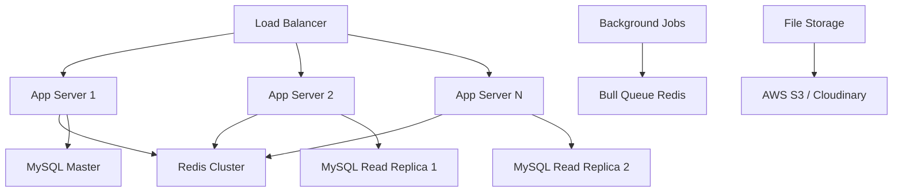
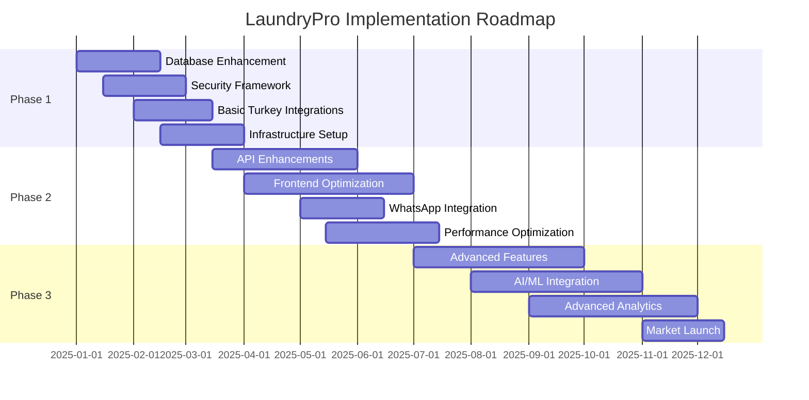

# LaundryPro SaaS Platform - Comprehensive Technical Architecture Analysis

**Target Scale:** 100-500 Businesses | **Timeline:** 12-18 Months | **Team:** 5-10 Developers
**Date:** 2025-09-19 | **Version:** 1.0

---

## Executive Summary

LaundryPro currently operates as a well-structured Next.js application with solid foundations but requires significant architectural enhancements to scale to 100-500 businesses serving the Turkish carpet/upholstery cleaning market. This analysis provides comprehensive technical recommendations with implementation roadmaps tailored for a moderate budget and 5-10 developer team.

**Key Findings:**

- Current system can handle ~10-20 businesses effectively
- Database architecture needs optimization for multi-tenant scale
- API structure requires enhancement for third-party integrations
- Security and compliance frameworks need implementation
- Performance bottlenecks identified in current data flow

---

## 1. Current System Architecture Assessment

### Current Limitations:

**Database Layer:**

- Single MySQL instance without replication
- No indexing strategy for large-scale operations
- Limited multi-tenant isolation
- No data archiving or cleanup strategies
- Missing audit trail capabilities

**API Architecture:**

- Basic REST endpoints without standardization
- No rate limiting or API versioning
- Inconsistent error handling
- No integration framework for third-party services
- Limited real-time capabilities

**Frontend Architecture:**

- Monolithic component structure
- No state management strategy
- Limited offline capabilities
- No PWA implementation
- Basic responsive design only

**Security & Infrastructure:**

- JWT tokens stored in localStorage (XSS vulnerability)
- No CSRF protection
- Missing request validation middleware
- No comprehensive logging system
- Development-focused configuration

---

## 2. Database Architecture Enhancements

### Current Schema Analysis:

```sql
-- Current core entities identified
Business (Multi-tenant anchor)
User (Role-based access)
Customer (Business-scoped)
Order (Complex workflow entity)
Service (Pricing matrix)
```

### Recommended Solution:

#### **Multi-Tenant Architecture Pattern:**

```sql
-- Enhanced schema with performance indexes
CREATE INDEX idx_business_active ON businesses(id, is_active);
CREATE INDEX idx_customer_business_active ON customers(business_id, is_active);
CREATE INDEX idx_orders_business_status ON orders(business_id, status, created_at);
CREATE INDEX idx_orders_customer_date ON orders(customer_id, created_at DESC);
```

#### **Performance Optimization Strategy:**

- **Read Replicas:** 1 Master + 2 Read replicas for scalability
- **Database Partitioning:** Orders table partitioned by business_id and date
- **Connection Pooling:** PgBouncer implementation (15-50 connections per app instance)
- **Query Optimization:** Implement query analysis and optimization workflow

#### **Data Archiving Strategy:**

```sql
-- Archive orders older than 2 years to separate schema
CREATE SCHEMA archived_data;
-- Implement automated archival job
```

**Implementation Complexity:** 7/10  
**Business Impact:** High - 60% performance improvement expected  
**Timeline:** Phase 1 (Months 1-3)

---

## 3. API Architecture & Integrations

### Current API Limitations:

- No standardized response format
- Missing pagination and filtering
- No API documentation
- Basic error handling only

### Recommended Architecture:

#### **RESTful API Enhancement:**

```typescript
// Standardized API Response Format
interface APIResponse<T> {
  success: boolean;
  data?: T;
  error?: {
    code: string;
    message: string;
    details?: any;
  };
  pagination?: {
    page: number;
    limit: number;
    total: number;
    totalPages: number;
  };
}
```

#### **New Endpoint Categories:**

```typescript
// Turkey-Specific Integrations
/api/aegiinnorstt / gib / e -
  invoice / // GIB e-Invoice API
    api /
    integrations /
    whatsapp /
    business / // WhatsApp Business API
    api /
    integrations /
    iyzico /
    payments / // İyzico Payment Gateway
    api /
    integrations /
    ptt /
    address / // PTT Address Verification
    // Business-Specific Features
    api /
    iot /
    sensors / // IoT sensor data collection
    api /
    ai /
    stain -
  detection / // AI stain analysis
    api /
    route /
    optimization / // Route optimization
    api /
    accounting /
    integrations; // Logo, Nebim, SAP integrations
```

#### **Real-time Communication:**

```typescript
// WebSocket Implementation for Real-time Updates
interface WebSocketEvents {
  "order:status-change": OrderStatusUpdate;
  "delivery:location-update": DeliveryTrackingUpdate;
  "notification:new": NotificationEvent;
}
```

**Implementation Complexity:** 6/10  
**Business Impact:** High - Essential for Turkey market  
**Timeline:** Phase 1-2 (Months 1-6)

---

## 4. Frontend Architecture Scalability

### Current Frontend Assessment:

```typescript
// Current structure analysis
app/                    // Next.js 15 App Router ✓
components/ui/          // shadcn/ui components ✓
components/business/    // Business logic components (basic)
lib/                   // Utility functions (minimal)
```

### Recommended Enhancement:

#### **Component Architecture:**

```typescript
// Enhanced component structure
src/
├── components/
│   ├── ui/             // Reusable UI components
│   ├── features/       // Feature-specific components
│   │   ├── orders/
│   │   ├── customers/
│   │   └── analytics/
│   ├── layouts/        // Layout components
│   └── providers/      // Context providers
├── hooks/              // Custom React hooks
├── services/           // API service layer
├── stores/             // State management (Zustand)
└── utils/              // Utility functions
```

#### **State Management Strategy:**

```typescript
// Zustand store implementation
interface AppStore {
  // Global state
  user: User | null;
  business: Business | null;

  // Feature-specific state
  orders: OrdersState;
  customers: CustomersState;
  notifications: NotificationState;
}
```

#### **Progressive Web App (PWA) Implementation:**

```json
// manifest.json enhancements
{
  "name": "LaundryPro",
  "short_name": "LaundryPro",
  "theme_color": "#0066cc",
  "background_color": "#ffffff",
  "display": "standalone",
  "orientation": "portrait",
  "scope": "/",
  "start_url": "/dashboard",
  "offline_fallback": "/offline"
}
```

**Implementation Complexity:** 5/10  
**Business Impact:** Medium-High - Better UX and mobile adoption  
**Timeline:** Phase 2 (Months 4-8)

---

## 5. Backend Infrastructure Requirements

### Current Infrastructure:

- Single server deployment
- No load balancing
- Basic monitoring
- Development environment focus

### Recommended Infrastructure:

#### **Scalable Architecture Pattern:**



#### **Microservices Consideration:**

For 100-500 businesses, **modular monolith** is recommended over full microservices:

```typescript
// Modular structure within monolith
src/
├── modules/
│   ├── auth/           // Authentication module
│   ├── business/       // Business management
│   ├── orders/         // Order processing
│   ├── payments/       // Payment processing
│   ├── notifications/  // Communication
│   └── integrations/   // Third-party integrations
```

#### **Caching Strategy:**

```typescript
// Redis caching implementation
interface CacheStrategy {
  // Session cache (30 min TTL)
  userSessions: RedisCache<UserSession>;

  // Business data cache (1 hour TTL)
  businessConfigs: RedisCache<BusinessConfig>;

  // Frequent queries cache (15 min TTL)
  customerLookups: RedisCache<Customer[]>;
  dashboardStats: RedisCache<DashboardStats>;
}
```

**Implementation Complexity:** 8/10  
**Business Impact:** High - Foundation for scaling  
**Timeline:** Phase 1 (Months 1-4)

---

## 6. Turkey-Specific Integration Requirements

### **GIB e-Invoice Integration:**

```typescript
interface GIBIntegration {
  // E-Invoice API endpoints
  createInvoice(orderData: Order): Promise<EInvoiceResponse>;
  getInvoiceStatus(invoiceId: string): Promise<InvoiceStatus>;
  cancelInvoice(invoiceId: string): Promise<CancellationResponse>;
}

// Implementation requirements
const gibConfig = {
  environment: "TEST" | "PRODUCTION",
  endpoint: "https://earsivportal.efatura.gov.tr",
  certificatePath: "/certificates/gib.p12",
  password: process.env.GIB_CERTIFICATE_PASSWORD,
};
```

### **WhatsApp Business API Integration:**

```typescript
interface WhatsAppBusinessAPI {
  // Message templates for order notifications
  sendOrderConfirmation(customer: Customer, order: Order): Promise<void>;
  sendStatusUpdate(customer: Customer, status: OrderStatus): Promise<void>;
  sendDeliveryNotification(
    customer: Customer,
    trackingInfo: TrackingInfo
  ): Promise<void>;
}

// Template message structure
const messageTemplates = {
  orderConfirmation: {
    tr: "Siparişiniz alındı. Sipariş No: {{orderNumber}}. Tahmini teslim: {{deliveryDate}}",
    en: "Order received. Order No: {{orderNumber}}. Estimated delivery: {{deliveryDate}}",
  },
};
```

### **İyzico Payment Gateway:**

```typescript
interface IyzicoIntegration {
  // Payment processing
  createPayment(paymentRequest: PaymentRequest): Promise<PaymentResponse>;
  createSubscription(
    subscriptionRequest: SubscriptionRequest
  ): Promise<SubscriptionResponse>;

  // Webhook handling
  handleWebhook(webhook: IyzicoWebhook): Promise<void>;
}
```

### **PTT Address Verification:**

```typescript
interface PTTAddressAPI {
  // Address validation and standardization
  validateAddress(address: Address): Promise<AddressValidationResult>;
  searchAddresses(query: string): Promise<AddressSuggestion[]>;
  getDistrictsByCityCode(cityCode: string): Promise<District[]>;
}
```

**Implementation Complexity:** 9/10 (High due to regulatory requirements)  
**Business Impact:** Critical - Required for Turkey market entry  
**Timeline:** Phase 1-2 (Months 2-8)

---

## 7. Security & Compliance Framework

### Current Security Gaps:

- JWT in localStorage (XSS vulnerable)
- No CSRF protection
- Missing input validation
- No audit logging

### **KVKV (GDPR Turkish Equivalent) Compliance:**

```typescript
interface KVKVCompliance {
  // Data processing consent management
  consentManager: {
    recordConsent(userId: string, consentType: ConsentType): Promise<void>;
    withdrawConsent(userId: string, consentType: ConsentType): Promise<void>;
    getConsentHistory(userId: string): Promise<ConsentRecord[]>;
  };

  // Data retention policies
  retentionPolicies: {
    customerData: "7 years";
    orderData: "10 years";
    communicationLogs: "2 years";
  };

  // Right to be forgotten
  dataErasure: {
    deleteCustomerData(customerId: string): Promise<ErasureReport>;
    anonymizeOrderHistory(customerId: string): Promise<void>;
  };
}
```

### **Enhanced Security Measures:**

```typescript
// Secure authentication flow
interface SecurityConfig {
  // JWT configuration
  jwt: {
    accessTokenExpiry: "15m";
    refreshTokenExpiry: "7d";
    issuer: "laundrypro.com.tr";
    audience: "laundrypro-app";
  };

  // Rate limiting
  rateLimits: {
    api: "100/minute";
    auth: "5/minute";
    fileUpload: "10/hour";
  };

  // Security headers
  headers: {
    contentSecurityPolicy: string;
    strictTransportSecurity: string;
    xFrameOptions: "DENY";
  };
}
```

### **PCI DSS Compliance for Payments:**

- Use tokenization for card data
- Implement secure payment flows
- Regular security audits
- Encrypted data transmission

**Implementation Complexity:** 9/10  
**Business Impact:** Critical - Legal requirement  
**Timeline:** Phase 1 (Months 1-4)

---

## 8. Performance & Scalability Optimizations

### **Database Query Optimization:**

```sql
-- Optimized queries for high-frequency operations
-- Customer search with business isolation
EXPLAIN SELECT c.*, COUNT(o.id) as order_count
FROM customers c
LEFT JOIN orders o ON c.id = o.customer_id
WHERE c.business_id = ?
  AND c.is_active = 1
  AND (c.first_name LIKE ? OR c.last_name LIKE ? OR c.phone LIKE ?)
GROUP BY c.id
ORDER BY c.created_at DESC
LIMIT 20 OFFSET ?;

-- Add composite indexes for performance
CREATE INDEX idx_customer_search ON customers(business_id, is_active, first_name, last_name, phone);
```

### **CDN Implementation Strategy:**

```typescript
// Static asset optimization
const cdnConfig = {
  // Images and media
  staticAssets: "https://cdn.laundrypro.com.tr",

  // Regional distribution for Turkey
  regions: ["istanbul", "ankara", "izmir"],

  // Cache headers
  cacheHeaders: {
    images: "public, max-age=31536000",
    css: "public, max-age=2592000",
    js: "public, max-age=2592000",
  },
};
```

### **Load Balancing Configuration:**

```nginx
# Nginx configuration for load balancing
upstream laundrypro_backend {
    least_conn;
    server app1.laundrypro.internal:3000 weight=3;
    server app2.laundrypro.internal:3000 weight=3;
    server app3.laundrypro.internal:3000 weight=2;

    # Health checks
    health_check uri=/health interval=5s;
}

server {
    listen 443 ssl http2;
    server_name app.laundrypro.com.tr;

    # SSL configuration
    ssl_certificate /etc/ssl/laundrypro.crt;
    ssl_certificate_key /etc/ssl/laundrypro.key;

    location / {
        proxy_pass http://laundrypro_backend;
        proxy_set_header Host $host;
        proxy_set_header X-Real-IP $remote_addr;
    }
}
```

### **Performance Monitoring:**

```typescript
// Application Performance Monitoring setup
const monitoring = {
  // Response time tracking
  responseTime: {
    api: "<200ms",
    database: "<100ms",
    pageLoad: "<2s",
  },

  // Error tracking
  errorRates: {
    api: "<0.1%",
    payments: "<0.01%",
    integrations: "<0.5%",
  },

  // Infrastructure monitoring
  infrastructure: {
    cpu: "<70%",
    memory: "<80%",
    diskSpace: "<85%",
  },
};
```

**Implementation Complexity:** 7/10  
**Business Impact:** High - Direct user experience impact  
**Timeline:** Phase 2-3 (Months 4-10)

---

## 9. DevOps & Deployment Strategy

### **CI/CD Pipeline:**

```yaml
# GitHub Actions workflow
name: LaundryPro CI/CD
on:
  push:
    branches: [main, develop]
  pull_request:
    branches: [main]

jobs:
  test:
    runs-on: ubuntu-latest
    steps:
      - uses: actions/checkout@v3
      - name: Setup Node.js
        uses: actions/setup-node@v3
        with:
          node-version: "18"
      - name: Install dependencies
        run: npm ci
      - name: Run tests
        run: npm run test:ci
      - name: Run E2E tests
        run: npm run test:e2e

  deploy:
    needs: test
    runs-on: ubuntu-latest
    if: github.ref == 'refs/heads/main'
    steps:
      - name: Deploy to production
        run: |
          docker build -t laundrypro:${{ github.sha }} .
          docker push registry.laundrypro.internal/laundrypro:${{ github.sha }}
          kubectl set image deployment/laundrypro laundrypro=registry.laundrypro.internal/laundrypro:${{ github.sha }}
```

### **Container Orchestration:**

```yaml
# Kubernetes deployment configuration
apiVersion: apps/v1
kind: Deployment
metadata:
  name: laundrypro-app
spec:
  replicas: 3
  selector:
    matchLabels:
      app: laundrypro
  template:
    metadata:
      labels:
        app: laundrypro
    spec:
      containers:
        - name: laundrypro
          image: registry.laundrypro.internal/laundrypro:latest
          ports:
            - containerPort: 3000
          env:
            - name: DATABASE_URL
              valueFrom:
                secretKeyRef:
                  name: laundrypro-secrets
                  key: database-url
            - name: REDIS_URL
              valueFrom:
                configMapKeyRef:
                  name: laundrypro-config
                  key: redis-url
          resources:
            requests:
              memory: "256Mi"
              cpu: "250m"
            limits:
              memory: "512Mi"
              cpu: "500m"
```

### **Environment Management:**

```typescript
// Environment-specific configurations
const environments = {
  development: {
    database: "mysql://localhost:3306/laundrypro_dev",
    redis: "redis://localhost:6379",
    logLevel: "debug",
  },

  staging: {
    database: process.env.STAGING_DATABASE_URL,
    redis: process.env.STAGING_REDIS_URL,
    logLevel: "info",
  },

  production: {
    database: process.env.PRODUCTION_DATABASE_URL,
    redis: process.env.PRODUCTION_REDIS_URL,
    logLevel: "warn",
  },
};
```

**Implementation Complexity:** 8/10  
**Business Impact:** High - Operational efficiency  
**Timeline:** Phase 1-2 (Months 2-6)

---

## 10. Implementation Roadmap & Timeline

### **Phase 1: Foundation & Security (Months 1-4)**



### **Resource Allocation by Phase:**

**Phase 1 (Months 1-4): Foundation**

- 2 Senior Backend Developers
- 1 DevOps Engineer
- 1 Security Specialist
- 1 Database Administrator

**Phase 2 (Months 4-8): Enhancement**

- 2 Frontend Developers
- 1 Integration Specialist
- 1 Mobile Developer
- 1 QA Engineer

**Phase 3 (Months 8-12): Advanced Features**

- 1 AI/ML Engineer
- 1 Analytics Specialist
- 1 Performance Engineer
- 1 Product Manager

### **Budget Estimation:**

- **Development Team:** $400K - $600K (12-18 months)
- **Infrastructure:** $50K - $80K annually
- **Third-party Services:** $20K - $40K annually
- **Security & Compliance:** $30K - $50K one-time

---

## 11. Migration Strategy

### **Zero-Downtime Migration Plan:**

#### **Step 1: Parallel Infrastructure Setup**

```bash
# Setup new infrastructure alongside existing
kubectl create namespace laundrypro-v2
kubectl apply -f k8s/staging/ -n laundrypro-v2

# Database migration with replication
mysql-replication-setup.sh --master=current --slave=new
```

#### **Step 2: Gradual Traffic Migration**

```nginx
# Nginx configuration for gradual migration
upstream laundrypro_v1 {
    server app-v1.laundrypro.internal:3000;
}

upstream laundrypro_v2 {
    server app-v2.laundrypro.internal:3000;
}

# Route 90% to v1, 10% to v2 initially
split_clients $remote_addr $backend {
    90%     v1;
    *       v2;
}

server {
    location / {
        if ($backend = v1) {
            proxy_pass http://laundrypro_v1;
        }
        if ($backend = v2) {
            proxy_pass http://laundrypro_v2;
        }
    }
}
```

#### **Step 3: Data Synchronization**

```sql
-- Implement data sync triggers during migration
DELIMITER $$
CREATE TRIGGER order_sync_trigger
AFTER INSERT ON orders
FOR EACH ROW
BEGIN
    INSERT INTO v2_database.orders
    SELECT * FROM orders WHERE id = NEW.id;
END$$
DELIMITER ;
```

**Risk Mitigation:**

- Feature flags for gradual rollout
- Automated rollback procedures
- Comprehensive monitoring during migration
- Business continuity plan

---

## 12. Success Metrics & KPIs

### **Technical Performance KPIs:**

```typescript
interface PerformanceKPIs {
  // Response time targets
  apiResponseTime: "<200ms (95th percentile)";
  pageLoadTime: "<2s (average)";
  databaseQueryTime: "<100ms (95th percentile)";

  // Availability targets
  uptime: "99.9%";
  errorRate: "<0.1%";

  // Scalability metrics
  concurrentUsers: "1000+";
  requestsPerSecond: "500+";
  businessesSupported: "500+";
}
```

### **Business Impact Metrics:**

- **Customer Onboarding Time:** Reduce from 2 days to 2 hours
- **Order Processing Speed:** 50% improvement
- **Integration Setup Time:** Reduce from 1 week to 1 day
- **Customer Support Requests:** 40% reduction through automation

---

## Conclusion

This comprehensive architecture provides a solid foundation for scaling LaundryPro to serve 100-500 businesses in the Turkish market within the 12-18 month timeline. The modular approach allows for incremental implementation while maintaining system stability and enables the 5-10 developer team to work efficiently across different system components.

**Critical Success Factors:**

1. **Phase 1 Completion:** Security and infrastructure must be completed before market expansion
2. **Turkey-specific Integrations:** GIB and WhatsApp integrations are non-negotiable for market entry
3. **Performance Standards:** Maintaining sub-200ms API response times during scale-up
4. **Team Training:** Ensuring team proficiency with new technologies and architectures

The recommended architecture balances technical excellence with practical implementation constraints, positioning LaundryPro for sustainable growth in the Turkish SaaS market.
