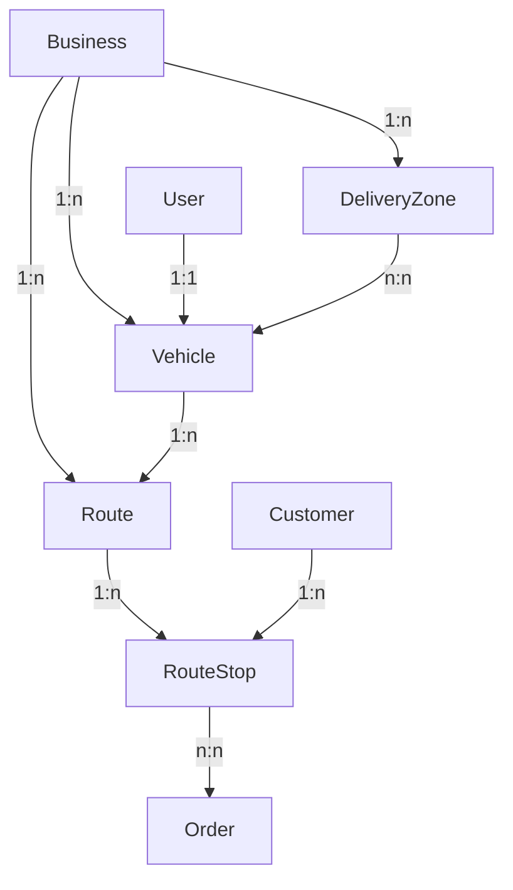

# Route Planning System - Database Schema Design

## Overview

This document outlines a comprehensive database schema design for a route planning system integrated with the existing cleaning service platform. The system supports mixed pickup/delivery routes, distance optimization, city district-based zones, and real-time tracking.

## Requirements Analysis

### Key Requirements

- **Mixed capacity tracking**: Weight + item count
- **Distance optimization**: Minimize total route distance
- **Geographic coverage**: City district-based delivery zones
- **Combined operations**: Pickup and delivery in same routes
- **Real-time tracking**: Driver location + ETA tracking

### Existing System Integration

- Leverages existing `User` model with `DRIVER` role
- Integrates with current `Order` model (pickup/delivery fields)
- Uses existing `Customer` location data
- Extends current `OrderStatus` workflow

## Schema Design

### 1. New Enums

```prisma
// Route planning specific enums
enum RouteType {
  PICKUP_ONLY     // Sadece teslim alma rotası
  DELIVERY_ONLY   // Sadece teslim rotası
  MIXED           // Karma rota (teslim alma + teslim)
  RETURN          // Geri dönüş rotası
}

enum RouteStatus {
  PLANNED         // Planlandı
  ASSIGNED        // Sürücüye atandı
  IN_PROGRESS     // Devam ediyor
  PAUSED          // Durduruldu
  COMPLETED       // Tamamlandı
  CANCELLED       // İptal edildi
}

enum StopType {
  PICKUP          // Teslim alma durağı
  DELIVERY        // Teslim durağı
  DEPOT           // Depo/başlangıç noktası
  BREAK           // Mola durağı
}

enum VehicleStatus {
  AVAILABLE       // Müsait
  IN_USE          // Kullanımda
  MAINTENANCE     // Bakımda
  OUT_OF_SERVICE  // Hizmet dışı
  RETIRED         // Emekli
}

enum StopStatus {
  PENDING         // Beklemede
  EN_ROUTE        // Yolda
  ARRIVED         // Varış
  IN_PROGRESS     // İşlem devam ediyor
  COMPLETED       // Tamamlandı
  FAILED          // Başarısız
  SKIPPED         // Atlandı
}
```

### 2. Vehicle Model

```prisma
// Araç yönetimi modeli
model Vehicle {
  id               String        @id @default(cuid())
  businessId       String        @map("business_id")

  // Temel araç bilgileri
  plateNumber      String        @unique @map("plate_number")
  brand            String        // Mercedes, Ford, Iveco
  model            String        // Sprinter, Transit, Daily
  year             Int?
  color            String?

  // Kapasite bilgileri (mixed capacity)
  maxWeightKg      Decimal       @map("max_weight_kg") @db.Decimal(8, 2)
  maxItemCount     Int           @map("max_item_count")
  maxVolumeM3      Decimal?      @map("max_volume_m3") @db.Decimal(6, 2)

  // Operasyonel bilgiler
  status           VehicleStatus @default(AVAILABLE)
  isActive         Boolean       @default(true) @map("is_active")

  // Sürücü ataması
  assignedDriverId String?       @unique @map("assigned_driver_id")

  // Özellikler ve kısıtlamalar
  hasGps           Boolean       @default(true) @map("has_gps")
  hasRefrigeration Boolean       @default(false) @map("has_refrigeration")
  canHandleFragile Boolean       @default(true) @map("can_handle_fragile")

  // Maliyet bilgileri
  fuelCostPerKm    Decimal?      @map("fuel_cost_per_km") @db.Decimal(5, 3)
  operatingCostPerHour Decimal?  @map("operating_cost_per_hour") @db.Decimal(8, 2)

  // Bakım bilgileri
  lastMaintenanceDate DateTime?  @map("last_maintenance_date")
  nextMaintenanceKm   Int?       @map("next_maintenance_km")
  currentKm           Int        @default(0) @map("current_km")

  // Timestamps
  createdAt        DateTime      @default(now()) @map("created_at")
  updatedAt        DateTime      @updatedAt @map("updated_at")

  // Relations
  business         Business      @relation(fields: [businessId], references: [id])
  assignedDriver   User?         @relation("DriverVehicle", fields: [assignedDriverId], references: [id])
  routes           Route[]
  deliveryZones    VehicleDeliveryZone[]
  trackingLogs     VehicleTrackingLog[]

  @@map("vehicles")
}
```

### 3. DeliveryZone Model

```prisma
// Teslimat bölgeleri (şehir ilçe bazlı)
model DeliveryZone {
  id          String   @id @default(cuid())
  businessId  String   @map("business_id")

  // Coğrafi bilgiler
  name        String   // "Kadıköy", "Beşiktaş", "Şişli"
  city        String   // İstanbul, Ankara, İzmir
  district    String   // İlçe adı

  // Bölge sınırları (polygon coordinates)
  boundaries  String?  @db.Text // GeoJSON polygon coordinates

  // Merkez koordinatları
  centerLat   Float?   @map("center_lat")
  centerLng   Float?   @map("center_lng")

  // Operasyonel bilgiler
  isActive    Boolean  @default(true) @map("is_active")
  priority    Int      @default(1) // 1=yüksek, 5=düşük

  // Zaman kısıtlamaları
  serviceStartTime String? @map("service_start_time") // "09:00"
  serviceEndTime   String? @map("service_end_time")   // "18:00"

  // Servis günleri (JSON array)
  serviceDays      String? @map("service_days") // ["monday", "tuesday", ...]

  createdAt   DateTime @default(now()) @map("created_at")
  updatedAt   DateTime @updatedAt @map("updated_at")

  // Relations
  business    Business @relation(fields: [businessId], references: [id])
  vehicles    VehicleDeliveryZone[]
  routeStops  RouteStop[]

  @@unique([businessId, city, district])
  @@map("delivery_zones")
}
```

### 4. Route Model

```prisma
// Ana rota planları
model Route {
  id                String      @id @default(cuid())
  businessId        String      @map("business_id")
  vehicleId         String      @map("vehicle_id")

  // Rota bilgileri
  routeName         String      @map("route_name") // "Kadıköy Günlük Rota - 2024-01-15"
  routeType         RouteType   @default(MIXED)
  status            RouteStatus @default(PLANNED)

  // Planlanan tarih ve saatler
  plannedDate       DateTime    @map("planned_date") @db.Date
  plannedStartTime  DateTime    @map("planned_start_time")
  plannedEndTime    DateTime?   @map("planned_end_time")

  // Gerçekleşen saatler
  actualStartTime   DateTime?   @map("actual_start_time")
  actualEndTime     DateTime?   @map("actual_end_time")

  // Rota istatistikleri
  totalDistance     Decimal?    @map("total_distance") @db.Decimal(8, 2) // km
  estimatedDuration Int?        @map("estimated_duration") // dakika
  actualDuration    Int?        @map("actual_duration")    // dakika

  // Kapasite kullanımı
  totalWeight       Decimal     @default(0) @map("total_weight") @db.Decimal(8, 2)
  totalItems        Int         @default(0) @map("total_items")

  // Optimizasyon bilgileri
  optimizedFor      String      @default("distance") // distance, time, priority
  optimizationScore Decimal?    @map("optimization_score") @db.Decimal(5, 2)

  // Maliyet hesaplaması
  estimatedCost     Decimal?    @map("estimated_cost") @db.Decimal(10, 2)
  actualCost        Decimal?    @map("actual_cost") @db.Decimal(10, 2)

  // Notlar ve talimatlar
  notes             String?     @db.Text
  driverInstructions String?    @map("driver_instructions") @db.Text

  createdAt         DateTime    @default(now()) @map("created_at")
  updatedAt         DateTime    @updatedAt @map("updated_at")

  // Relations
  business          Business    @relation(fields: [businessId], references: [id])
  vehicle           Vehicle     @relation(fields: [vehicleId], references: [id])
  stops             RouteStop[]
  assignments       RouteAssignment[]

  @@map("routes")
}
```

### 5. RouteStop Model

```prisma
// Rota durakları
model RouteStop {
  id                String       @id @default(cuid())
  routeId           String       @map("route_id")
  deliveryZoneId    String?      @map("delivery_zone_id")

  // Durak bilgileri
  stopType          StopType
  status            StopStatus   @default(PENDING)
  sequence          Int          // Durak sırası (1, 2, 3, ...)

  // Lokasyon bilgileri
  address           String
  latitude          Float?
  longitude         Float?

  // Müşteri ve sipariş bilgileri
  customerId        String?      @map("customer_id")
  customerName      String?      @map("customer_name")
  customerPhone     String?      @map("customer_phone")

  // Zaman bilgileri
  plannedArrival    DateTime?    @map("planned_arrival")
  estimatedArrival  DateTime?    @map("estimated_arrival")
  actualArrival     DateTime?    @map("actual_arrival")
  plannedDeparture  DateTime?    @map("planned_departure")
  actualDeparture   DateTime?    @map("actual_departure")

  // Servis bilgileri
  serviceTime       Int?         @map("service_time") // dakika
  waitingTime       Int?         @map("waiting_time") // dakika

  // Yük bilgileri
  itemCount         Int          @default(0) @map("item_count")
  weight            Decimal      @default(0) @map("weight") @db.Decimal(8, 2)

  // Talimatlar ve notlar
  specialInstructions String?    @map("special_instructions") @db.Text
  completionNotes     String?    @map("completion_notes") @db.Text

  // Fotoğraf ve imza
  photoUrl          String?      @map("photo_url")
  signatureUrl      String?      @map("signature_url")

  // Başarısızlık durumu
  failureReason     String?      @map("failure_reason")

  createdAt         DateTime     @default(now()) @map("created_at")
  updatedAt         DateTime     @updatedAt @map("updated_at")

  // Relations
  route             Route        @relation(fields: [routeId], references: [id], onDelete: Cascade)
  deliveryZone      DeliveryZone? @relation(fields: [deliveryZoneId], references: [id])
  customer          Customer?    @relation(fields: [customerId], references: [id])
  orders            RouteStopOrder[]

  @@map("route_stops")
}
```

### 6. RouteAssignment Model

```prisma
// Araç-rota atamaları
model RouteAssignment {
  id           String   @id @default(cuid())
  routeId      String   @map("route_id")
  vehicleId    String   @map("vehicle_id")
  driverId     String   @map("driver_id")

  // Atama bilgileri
  assignedAt   DateTime @default(now()) @map("assigned_at")
  assignedBy   String   @map("assigned_by") // User ID

  // Durum bilgileri
  status       String   @default("assigned") // assigned, accepted, rejected, completed
  acceptedAt   DateTime? @map("accepted_at")
  completedAt  DateTime? @map("completed_at")

  // Notlar
  notes        String?  @db.Text

  // Relations
  route        Route    @relation(fields: [routeId], references: [id], onDelete: Cascade)
  vehicle      Vehicle  @relation(fields: [vehicleId], references: [id])
  driver       User     @relation("RouteDriver", fields: [driverId], references: [id])
  assignedByUser User   @relation("RouteAssigner", fields: [assignedBy], references: [id])

  @@unique([routeId, vehicleId])
  @@map("route_assignments")
}
```

### 7. Supporting Models

```prisma
// Araç-bölge ilişkisi (çoka çok)
model VehicleDeliveryZone {
  id             String       @id @default(cuid())
  vehicleId      String       @map("vehicle_id")
  deliveryZoneId String       @map("delivery_zone_id")
  isActive       Boolean      @default(true) @map("is_active")
  createdAt      DateTime     @default(now()) @map("created_at")

  vehicle        Vehicle      @relation(fields: [vehicleId], references: [id], onDelete: Cascade)
  deliveryZone   DeliveryZone @relation(fields: [deliveryZoneId], references: [id], onDelete: Cascade)

  @@unique([vehicleId, deliveryZoneId])
  @@map("vehicle_delivery_zones")
}

// Durak-sipariş ilişkisi
model RouteStopOrder {
  id          String    @id @default(cuid())
  routeStopId String    @map("route_stop_id")
  orderId     String    @map("order_id")
  actionType  String    // "pickup", "delivery"
  sequence    Int       // Sipariş sırası bu durakta

  routeStop   RouteStop @relation(fields: [routeStopId], references: [id], onDelete: Cascade)
  order       Order     @relation(fields: [orderId], references: [id], onDelete: Cascade)

  @@unique([routeStopId, orderId])
  @@map("route_stop_orders")
}

// Araç takip logları (gerçek zamanlı)
model VehicleTrackingLog {
  id          String   @id @default(cuid())
  vehicleId   String   @map("vehicle_id")
  driverId    String?  @map("driver_id")
  routeId     String?  @map("route_id")

  // Lokasyon bilgileri
  latitude    Float
  longitude   Float
  accuracy    Float?   // GPS doğruluğu (metre)
  heading     Float?   // Yön (derece)
  speed       Float?   // Hız (km/h)

  // Durum bilgileri
  status      String   @default("active") // active, idle, offline
  battery     Int?     // Cihaz batarya seviyesi

  // Zaman damgası
  timestamp   DateTime @default(now())

  // Relations
  vehicle     Vehicle  @relation(fields: [vehicleId], references: [id], onDelete: Cascade)
  driver      User?    @relation("DriverTracking", fields: [driverId], references: [id])
  route       Route?   @relation(fields: [routeId], references: [id])

  @@index([vehicleId, timestamp])
  @@map("vehicle_tracking_logs")
}
```

## Model Relationships

### Core Relationships



### Extended Relationships

1. **User (Driver) ↔ Vehicle**: One-to-one relationship
2. **Vehicle ↔ DeliveryZone**: Many-to-many through `VehicleDeliveryZone`
3. **Route ↔ RouteStop**: One-to-many
4. **RouteStop ↔ Order**: Many-to-many through `RouteStopOrder`
5. **Route ↔ RouteAssignment**: One-to-many (for historical tracking)

## Integration with Existing Models

### Required Changes to Existing Models

```prisma
// User model - add new relations
model User {
  // ... existing fields ...

  // New route planning relations
  assignedVehicle    Vehicle? @relation("DriverVehicle")
  routeAssignments   RouteAssignment[] @relation("RouteDriver")
  createdAssignments RouteAssignment[] @relation("RouteAssigner")
  trackingLogs       VehicleTrackingLog[] @relation("DriverTracking")
}

// Business model - add new relations
model Business {
  // ... existing fields ...

  // New route planning relations
  vehicles       Vehicle[]
  deliveryZones  DeliveryZone[]
  routes         Route[]
}

// Order model - add new relations
model Order {
  // ... existing fields ...

  // New route planning relations
  routeStopOrders RouteStopOrder[]
}

// Customer model - add new relations
model Customer {
  // ... existing fields ...

  // New route planning relations
  routeStops RouteStop[]
}
```

## Optimization Features

### 1. Distance-Based Optimization

- Route planning considers GPS coordinates
- Minimizes total travel distance
- Accounts for traffic patterns (via external APIs)

### 2. Capacity Management

- Tracks both weight and item count
- Prevents overloading vehicles
- Optimizes load distribution

### 3. Real-Time Tracking

- GPS tracking via `VehicleTrackingLog`
- ETA calculations and updates
- Automatic status updates

### 4. Zone-Based Planning

- City district coverage
- Vehicle-zone assignments
- Service time restrictions

## Usage Examples

### 1. Creating a Daily Route

```sql
-- 1. Create route
INSERT INTO routes (business_id, vehicle_id, route_name, route_type, planned_date, planned_start_time)
VALUES ('business_123', 'vehicle_456', 'Kadıköy Günlük - 2024-01-15', 'MIXED', '2024-01-15', '2024-01-15 09:00:00');

-- 2. Add pickup stops
INSERT INTO route_stops (route_id, stop_type, sequence, address, customer_id)
VALUES ('route_789', 'PICKUP', 1, 'Bağdat Cad. No:123 Kadıköy', 'customer_111');

-- 3. Add delivery stops
INSERT INTO route_stops (route_id, stop_type, sequence, address, customer_id)
VALUES ('route_789', 'DELIVERY', 2, 'Moda Cad. No:456 Kadıköy', 'customer_222');
```

### 2. Assigning Route to Driver

```sql
INSERT INTO route_assignments (route_id, vehicle_id, driver_id, assigned_by)
VALUES ('route_789', 'vehicle_456', 'driver_user_id', 'manager_user_id');
```

### 3. Tracking Vehicle Location

```sql
INSERT INTO vehicle_tracking_logs (vehicle_id, driver_id, latitude, longitude, speed)
VALUES ('vehicle_456', 'driver_user_id', 41.0082, 28.9784, 45.5);
```

## Performance Considerations

### Database Indexes

```sql
-- Route optimization
CREATE INDEX idx_route_stops_route_sequence ON route_stops(route_id, sequence);
CREATE INDEX idx_vehicle_tracking_vehicle_time ON vehicle_tracking_logs(vehicle_id, timestamp);

-- Geographic queries
CREATE INDEX idx_delivery_zones_city_district ON delivery_zones(city, district);
CREATE INDEX idx_route_stops_location ON route_stops(latitude, longitude);

-- Status queries
CREATE INDEX idx_routes_status_date ON routes(status, planned_date);
CREATE INDEX idx_vehicles_status_active ON vehicles(status, is_active);
```

### Query Optimization

- Use proper indexing for geographic queries
- Implement pagination for large route lists
- Cache frequently accessed zone data
- Optimize real-time tracking queries

## Next Steps

1. **Schema Implementation**: Switch to Code mode to implement the schema
2. **Data Migration**: Plan migration strategy for existing data
3. **API Development**: Create route planning endpoints
4. **Mobile Integration**: Develop driver mobile app features
5. **Optimization Engine**: Implement route optimization algorithms
6. **Real-time Features**: Set up WebSocket connections for live tracking

This schema provides a solid foundation for a comprehensive route planning system that integrates seamlessly with your existing cleaning service platform while supporting distance optimization, real-time tracking, and efficient mixed pickup/delivery operations.
